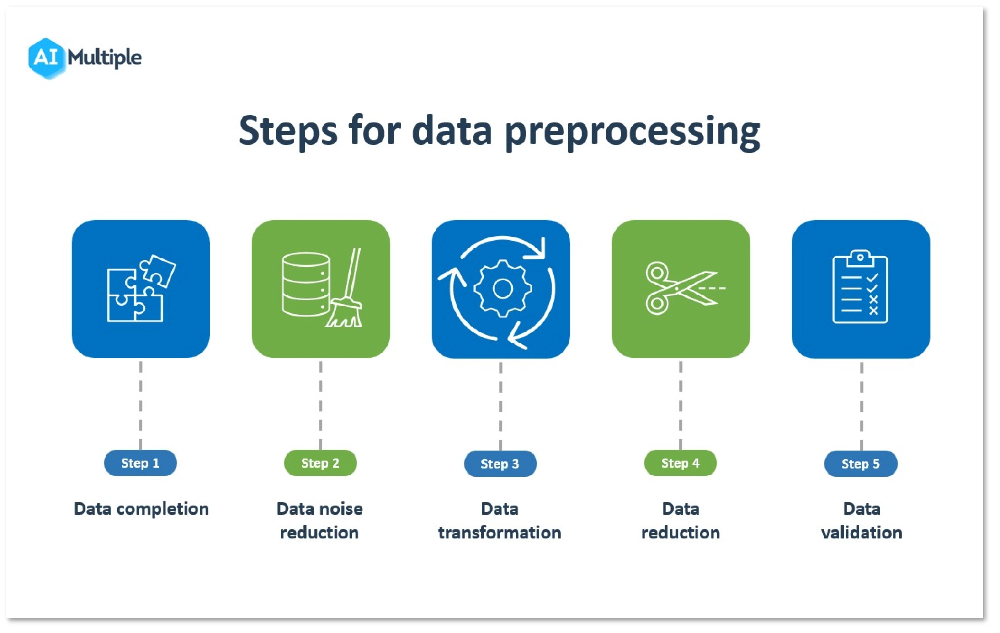
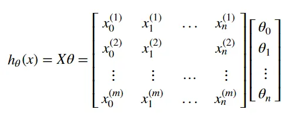
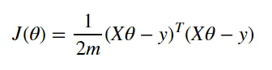
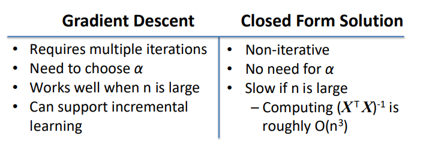

# Introduction

## _Linear regression is a supervised machine learning algorithm used for predicting a continuous target variable based on one or more input features. Vectorization is a technique used to optimize the computational efficiency of algorithms by performing operations on entire arrays (or vectors) of data, rather than individual elements._

# Procedures:

1) initialize dataset
2) preprocessing 
3) define hypothesis
4) Cost function (MSE)
5) update parameters
6) Repeat untill converge

# initialize dataset :
In vectorized linear regression, dataset typically consists of an input feature matrix denoted as X with dimensions (m, n+1), where m is the number of samples or instances, and n is the number of features or input variables. The corresponding target values, denoted as y, form a vector with dimensions (m, 1), representing the target values for each sample in X, we add a column in X for bias term(intercept) in calculations

# preprocessing : 
Data preprocessing refers to the cleaning, transforming, and normalization of raw data before it is used for analysis or modeling. It involves techniques such as data cleaning, data integration, data normalization, feature engineering, handling missing values, outliers, and categorical variables, and optimizing data for computational efficiency.

Data preprocessing is important because it:

-Ensures data consistency  
-Integrates data from different sources  
-Normalizes data for consistent scaling  
-Transforms data for capturing non-linear relationships  
-Handles missing values, outliers, and categorical variables  
-Improves model performance  
-Optimizes data for computational efficiency

# Define hypothesis :
-for non-vectorized linear regression we estimate f(x) using the following formula 
# f(x) = β0 + β1X1 + β2X2 + ..... βiXi     
β0 : intercept                        
βi : slope for Xi                     

-While for vectorized formula 

# Cost function (MSE):

-We use MSE with gradient descent for linear regression as its a convex function (just have a global minima)   

-for non-vectorized cost function
# J(x) = 1/2m  Σ( f(xi) - yi )^2

-While for vectorized  

# updating parameters:
-for updating parameters we can use gradient descent or closed form

# Repeat 
in case of gradient descent we will repeat that process untill coverage
-untill converge 
-number of iterations